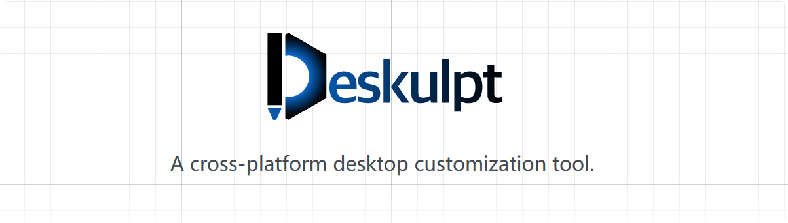

  

**Deskulpt** is a cross-platform desktop customization tool that allows you to write
React code to define widgets on your desktop. It is powered by [Tauri](https://tauri.app/),
and written in Rust and TypeScript.

The project was started in 2024 as a final project for the Software Engineering course
at [NYU Shanghai](https://shanghai.nyu.edu/). It is currently maintained by the original
authors.

Similar softwares exist ([Rainmeter](https://www.rainmeter.net/) for Windows,
[Ubersicht](https://tracesof.net/uebersicht/) for MacOS), but what makes Deskulpt
different is that:

- **Deskulpt is cross-platform.** To the best of our knowledge, Deskulpt is the first
  desktop customization tool that supports all major desktop platforms (Windows, MacOS,
  Linux).

- **Deskulpt is light-weight and memory-safe.** Deskulpt is powered by Tauri, which uses
  Rust as its backend. Tauri provides a more light-weight solution than other existing
  frameworks (e.g. Electron), and Rust guarantees the memory safety of Deskulpt.

Currently, Deskulpt supports the following platforms:

- Windows (10, 11)
- MacOS
- Linux (X11, tested on Ubuntu)

Website: https://csci-shu-410-se-project.github.io/Deskulpt/

## Development

We welcome new contributors of all experience levels. The goals of the Deskulpt
community are to be helpful, welcoming, and effective. The [developers' guide](https://csci-shu-410-se-project.github.io/Deskulpt/development/developer-guide/)
has detailed information about contributing code, documentation, tests, and more. We
also provide [developers' API references](https://csci-shu-410-se-project.github.io/Deskulpt/category/references/)
for both the frontend and backend of Deskulpt to help contributors better understand the
codebase.

## Authors

- [Xinyu-Li-123](https://github.com/Xinyu-Li-123)
- [Charlie-XIAO](https://github.com/Charlie-XIAO)
- [ROMEEZHOU](https://github.com/ROMEEZHOU)
- [rz2606](https://github.com/rz2606)
